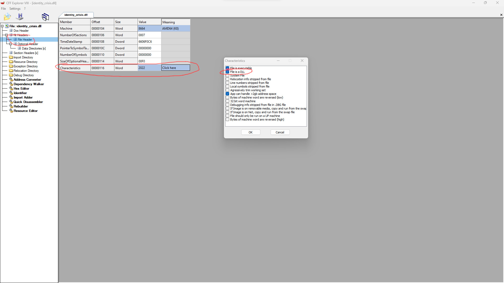

# Identity Crisis
We created an EXE and then tampered with its PE header. In the PE header there is a so called "characteristic", i.e. a flag or simply a bit, that determines if Windows should see the PE as an EXE or a DLL. Specifically, this characteristic is called [IMAGE_FILE_DLL](https://learn.microsoft.com/en-us/windows/win32/debug/pe-format#characteristics).
The bit can be flipped back with CFF Explorer, or with the LIEF Python library, the file renamed to have a `.exe` extension, and then run. It outputs a base64 of an image with the flag. Simply throw the base64 into CyberChef to get the image back.
